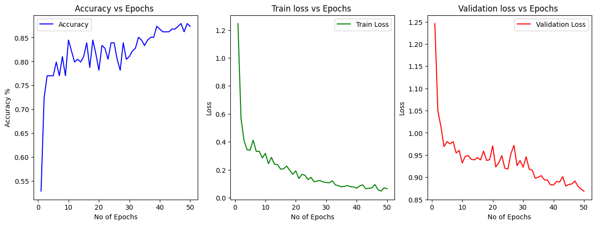
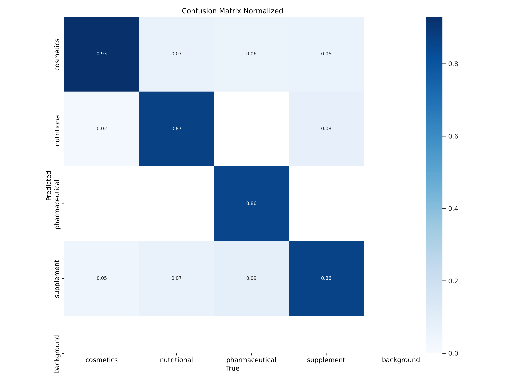
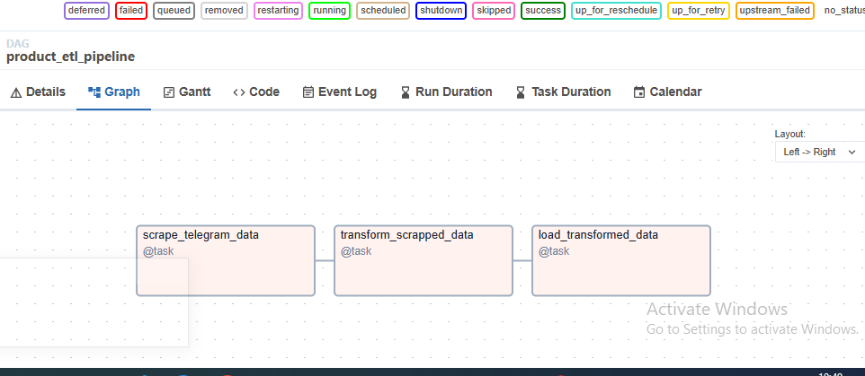
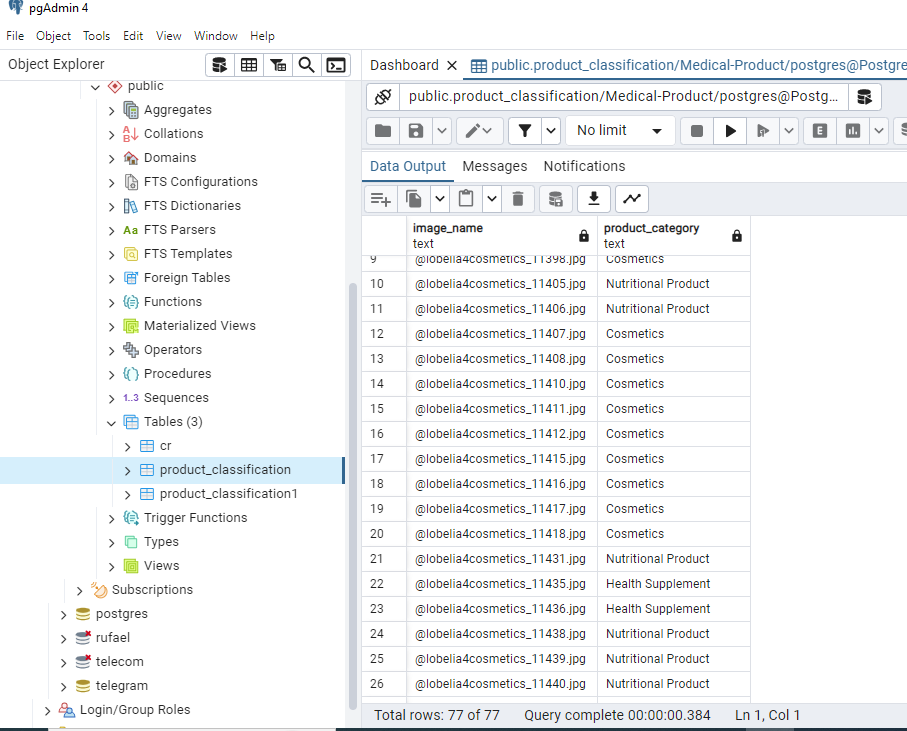
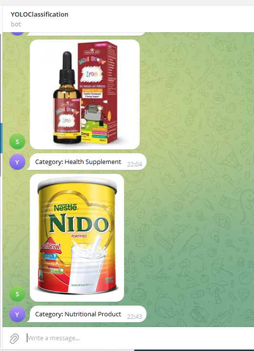
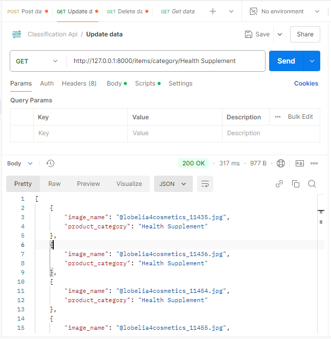

# Data Warehouse with YOLO Classification

This repository contains the ETL data pipeline orchestration for building a data warehouse aimed at analyzing data, with a specific focus on image classification using YOLO (You Only Look Once). The project collects data from a Telegram channel, processes images with the YOLO model, and stores the results in a PostgreSQL database.

## Table of Contents
- [Project Overview](#project-overview)
- [Project Structure](#project-structure)
- [Installation](#installation)
- [Features](#features)
- [Results](#Results)
- [Database Schema](#database-schema)
- [Contributing](#contributing)
- [License](#license)

## Project Overview
The **Data Warehouse with YOLO Classification** project scrapes image data from a Telegram channel, classifies the images using a YOLO model, and stores the results in a PostgreSQL database for analysis and reporting. The project uses FastAPI to expose the classified data through an API.

# Data Warehouse with YOLO Classification

This project involves setting up a data warehouse using ETL pipe line and integrating YOLO (You Only Look Once) for image classification. The pipeline scrapes data from a Telegram channel, performs image classification using the YOLO model, and stores the results in a PostgreSQL database. 
## Project Structure

├── .github.<br>
│   └── workflow<br>
│       └── test.yaml<br>
├── .venv <br>
├── .vscode<br>
│   └── settings.json<br>
├── api<br>
│   ├── crud.py<br>
│   ├── database.py<br>
│   ├── main.py<br>
│   ├── router.py<br>
│   ├── models.py<br>
│   ├── schemas.py<br>
├── dags<br>
├── models<br>
├── notebook<br>
│   ├── Data_scrapping_and_transformation.ipynb<br>
│   ├── Load_yolo_result_to_db.ipynb<br>
│   ├── Fine_Tune_YOLO_Classification.ipynb<br>
│   ├── YOLO_classification.ipynb<br>
│
├──script<br>
|   ├──data_cleaning_and_transformation.py<br>
│   ├──telegram_scrapper.py<br>
│   ├──YOLO_classification.py<br>
│   
├── YOLO_Classification_Bot<br>
├── .gitignore<br>
├── airflow_settings.yaml<br>
├──  docker-compose.yml<br>
├──  Dockerfile<br>
├──  README.MD<br>
├──  requirements.txt <br>
  

## Installation
1. **Clone the repository**:
```bash
    git clone https://github.com/wolderufael/Data-Warehouse-with-YOLO-Classification.git
    cd Data-Warehouse-with-YOLO-Classification
```
2. **Install dependencies**:

Make sure you have Python 3.8 or higher. Install dependencies with:
```
    pip install -r requirements.txt

```
3. **Set up environment variables:**

Create a .env file with your Telegram API credentials and other required environment variables:
```
    TG_API_ID=your_api_id
    TG_API_HASH=your_api_hash
    SESSION_NAME=your_session_name
    POSTGRES_CONN_ID=postgres_default
```
4.  Install `Astro`
```
    winget install -e --id Astronomer.Astro
```
5. Initialize `Astro`
```
    astro dev init
```
6. Start `Astro`
```
    astro dev start
```
## Features
- **Scraping:** Retrieves messages and images from a Telegram channel.
- **YOLO Classification**: Classifies images based on custom categories using YOLO model.
- **Data Warehouse**: Loads classified data into a PostgreSQL database for storage and querying.

## Results
### YOLO model fine tuning performance


### Airflow DAG tasks

### postgrsql

### Telegram Bot for YOLO classification
[Here](https://t.me/YOLOProductClassificationbot) is the link for the classification bot.


### API


## Contributing
Contributions to improve this project are welcome. If you'd like to contribute, please fork the repository and submit a pull request.

## License
This project is licensed under the MIT License. See the LICENSE file for details.


